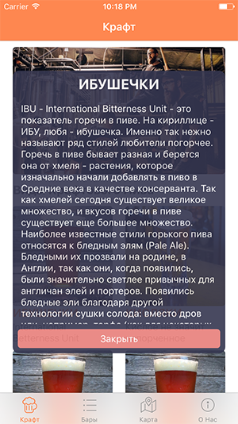

# MyPopoverPresentationController
## Current Syntax: Swift 3
Used for custom animated transition (like Apple's Popover Controller), but shows the destination controller at the centre of the screen and without triangle subview

** Frame and other setting are easilly controlled by editing swift class**<\br>

